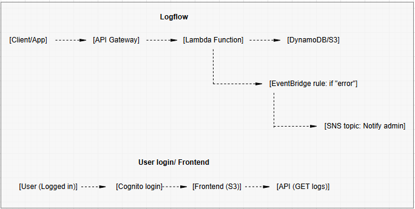
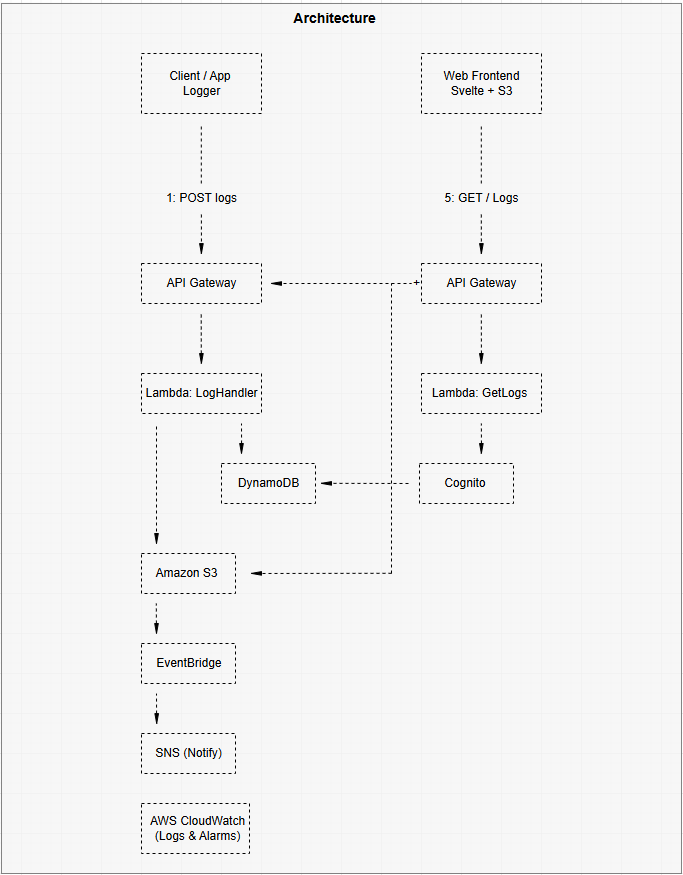

# LogThread

[](#)
[](#)
[](#)
[](#)


# Highlights

- **Cloud Integration:** Deeply integrated with AWS services including DynamoDB for structured logs, S3 for archiving, and SNS for real-time notifications.
- **Secure Authentication:** Integrated with AWS Cognito to provide robust user management and secure access to the logging dashboard.
- **Serverless Foundation:** Built using AWS Lambda and API Gateway, ensuring the backend is scalable, cost-efficient, and maintenance-free.
- **Interactive UI:** A modern frontend built with React and Vite, featuring real-time filtering, search capabilities, and log statistics.
- **Automated Alerts:** Built-in logic to trigger SNS notifications for critical system events, keeping developers informed without checking the dashboard.

# Overview

LogThread is a cloud-based logging service designed to streamline the way developers handle, view, and respond to application logs. In growing projects, managing logs locally or via the command line quickly becomes inefficient. This project solves that by providing a centralized, serverless platform to capture, store, and monitor logs across multiple environments.

By leveraging **FastAPI** for the backend and the **AWS Stack** for infrastructure, LogThread offers a professional-grade logging shell. Key capabilities include:
- **Dual-Stream Storage:** Choose between DynamoDB for high-speed searching or S3 for low-cost archival.
- **Validation & Metadata:** Every log is enriched with timestamps and user context before being persisted.
- **Environment Aware:** Ready for local development with `.env` support and fully prepared for CI/CD via GitHub Actions.

# Architecture
<details>
<summary><b>Click to expand architecture diagrams<b></summary>

**Log & User Flow**



**Infrastructure Architecture**



</details>
</br>

# Author

I'm Jonathan and I develop projects in my sparetime that help myself and others become better and more efficient developers!
- [Linkedin](https://www.linkedin.com/in/jonathan-windell-418a55232/)
- [Portfolio](https://portfolio.jonathans-labb.org/)

# Project Structure

```text
├── app/
│   ├── backend/
│   │   ├── apifiles/        # API Endpoints & Routing (LoggerAPI, S3Archive)
│   │   ├── config/          # Environment & App Settings (settings.py)
│   │   ├── logging/         # Core Logging Logic (Logger, MessageFormatter)
│   │   ├── service/         # AWS Integrations (SNS Config, Handlers, Wrappers)
│   │   └── main.py          # FastAPI Entry Point
│   └── frontend/
│       ├── src/
│       │   ├── images/      # UI Assets
│       │   ├── pages/       # React components (Dashboard, ApiTable, S3ArchivedTable)
│       │   ├── main.jsx     # Frontend entry point
│       │   └── style.css    # Global styling
│       ├── index.html       # Vite entry page
│       └── package.json     # Frontend dependencies
├── images/                  # Project documentation assets
├── .gitignore               # Files to be ignored by Git
├── LICENSE                  # MIT License
├── README.md                # Main Documentation
└── requirements.txt         # Python Backend dependencies
```

Quick Start

- 1: Clone the project: git clone `https://github.com/JonathanWindell/logthread.git`
- 2: Install dependencies: `pip install -r requirements.txt`
- 3: Set up your AWS credentials in a `.env` file.
- 4: Run the API: `uvicorn main:app --reload`

# Usage Instructions 

### 1: API Endpoints
The backend provides a RESTful interface for log management and system monitoring.

| Method |	Endpoint	Description |
| ------ | --------------------- | 
|POST	| /api/logs	Ingest a new log entry |
|GET	| /api/logs	Retrieve all logs from DynamoDB |
|GET	| /api/logs/{id}	Get specific log details |
|GET	| /api/logs/stats	View log counts and level distributions |
|GET	| /docs	Interactive Swagger/OpenAPI docs |

# 2: Log Levels

LogThread supports standard logging levels to categorize event severity:

- DEBUG: Verbose logs for troubleshooting.
- INFO: General operational events.
- WARNING: Unexpected behavior that doesn't halt the app.
- ERROR: Functional issues requiring attention.
- CRITICAL: Severe errors (automatically triggers SNS alerts).

# 3: The Dashboard

The UI (running at localhost:5173) allows you to:
- Filter: Sort logs by level or timestamp.
- Search: Query log messages for specific keywords.
- Monitor: Real-time visualization of system health.

# Installation Instructions

## Backend Setup

### 1. Clone the repository
git clone https://github.com/your-account/logthread.git
cd logthread

### 2. Create virtual enviroment
`python -m venv venv`
- `source venv/bin/activate`   # macOS/Linux

- `venv\Scripts\activate`      # windows

### 3. Install dependencies

pip install -r `requirements.txt`

### 4. Create `.env` file 
See Configuration

### 5. Start FastAPI server

uvicorn main:app --reload

The backend will now run at:

http://localhost:8000

Swagger Docs: http://localhost:8000/docs

## Frontend Setup

## 1. Navigate to frontend folder

`cd frontend`

### 2. Install frontend dependencies

`npm install`

### 3. Start the development server

`npm run dev`

The frontend will now run at:

http://localhost:5173


# Configuration

Create a `.env` file in the root directory. You must include your AWS IAM keys and service ARNs:

```
# AWS Config
AWS_REGION=your-region
AWS_ACCESS_KEY_ID=your-key
AWS_SECRET_ACCESS_KEY=your-secret

# Service Config
SNS_TOPIC_ARN=your-sns-arn
USER_POOL_ID=your-cognito-pool-id
CLIENT_ID=your-cognito-client-id
```

> **Security Note**: Never commit your `.env` file. It is included in the `.gitignore` by default to protect your AWS credentials.


# Contributions

Contributions make the developer community thrive! If you'd like to improve LogThread:
- 1: Fork the project.
- 2: Create a Feature Branch (git checkout -b feature/NewFeature).
- 3: Commit changes (git commit -m 'Add NewFeature').
- 4: Push and open a Pull Request.

# License

Distributed under the MIT License. See `LICENSE` file for more information.
