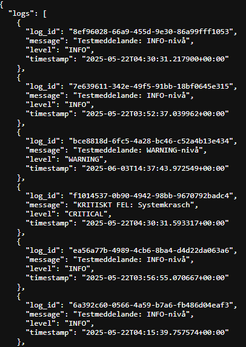
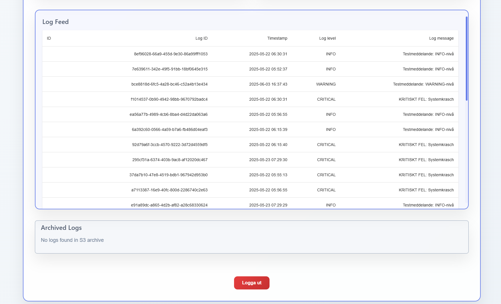

# Project Overview – LogThread

## Documentation

# 1: Vision & Scope
## Project Description
LogThread is a cloud-based logging service designed to streamline the way developers handle, view, and respond to application logs. Instead of combing through unstructured logs in the command line, Loggify enables centralized log management with clear filtering, real-time alerts, and a clean user interface.

## Motivation
The initial motivation comes from personal experience – managing logs locally becomes inefficient as projects grow. I first got the idea when learning Java and creating a logger that became the base for this project. You can find the MVP on my github. The goal is to build a serverless, scalable logging platform to simplify log access, monitoring, and alerting and really learning more about the cloud as I think it will give me a good foundation and headstart when entering the work field. The first version will be tailored for personal use, with future plans to open it up to fellow developers for feedback and enhancements. 

## Core Features
|    | Feature               | Description |
|----|-----------------------|-------------|
| 1  | Log Collection        | Send logs to a public API via a language-specific logger (starting with a Java-based MVP logger). |
| 2  | Cloud Storage         | Save logs to either DynamoDB (structured search/filtering) or Amazon S3 (low-cost archiving). User-selectable. |
| 3  | Alerting              | Notify users via email/SNS for critical logs (e.g., `ERROR` level). |
| 4  | User Interface        | Web frontend to view, filter, and manage logs. |
| 5  | Authentication        | Secure login and user management with AWS Cognito. |
| 6  | CI/CD                 | Automated deployment pipeline using GitHub Actions + Serverless Framework. |
| 7  | Monitoring            | Infrastructure/error monitoring via AWS CloudWatch. |

## Technology Stack
| Layer           | Tool/Service                          |
|-----------------|---------------------------------------|
| Backend         | Python + AWS Lambda + API Gateway     |
| Storage         | DynamoDB (structured logs), S3 (archives) |
| Frontend        | React + Vite (lightweight reactive UI) |
| Authentication  | AWS Cognito                           |
| CI/CD           | GitHub Actions + Serverless Framework |
| Monitoring      | AWS CloudWatch + SNS                  |
| Logger Client   | Python with Boto3                     |

# 2: Planning & Design

## Logflow & User login
The flows represent how the website/ app will transfer data through the layers. I’ve chosen AWS stack because it’s easier to get going. 

## Architecture

## Architecture explained:
#### Log gathering
1: Client sends logs to the REST endpoint through API Gateway.
2: API Gateway passes on to Lambda (LogHandler) that:
Validates logging data.
Adds metadata such as timestamp & user.
Saves in DynamoDB or S3 depending on structure and user choice. 

#### Notifications
3: SNS is integrated which let's user decide which level of logs to activate SNS at. Default is CRITICAL

#### Authentication & Frontend
4: Users login through Cognito Hosted UI.
5: Frontend calls GET / logs through API Gateway.
6: API endpoints retrieves data that is of relevance from DynamoDB and returns data to frontend.

# 3: Implementation
The logger is now feature-complete for core functionality, providing a robust tool for developers to integrate with their projects. While minor optimizations remain, the implementation covers all critical aspects of log collection, storage, alerting, and user interaction.

### Key Achievements:
#### AWS Stack Integration:
Leveraged DynamoDB (structured logs) and S3 (archiving) for flexible storage.
Implemented Cognito for authentication (optional but valuable for learning AWS services).
Used Lambda + API Gateway for serverless log processing.

#### Developer-Centric Design:
Local-first approach: Designed to run seamlessly on local machines with easy customization.
Modular code: Components like the Python logger client (boto3) and React frontend can be swapped or extended.

#### Features Delivered:
Real-time log filtering/search via the React+Vite UI.
Email/SNS alerts for ERROR-level logs.
Environment-aware configuration (.env support).

### Pending Items:
#### CI/CD Pipeline:
Planned: Automate deployments using GitHub Actions + Serverless Framework.

#### Monitoring:
Future: Integrate CloudWatch for metrics/dashboards (stretch goal).

#### Lessons Learned:
AWS Best Practices: Gained hands-on experience with serverless architectures and IAM roles.
Trade-offs: Cognito added complexity but deepened understanding of auth flows.
Debugging: Instrumented Lambda logs extensively for troubleshooting.

#### Future Enhancements:
Add multi-language SDKs (Node.js, Java) for broader adoption.
Support custom log parsing rules in DynamoDB.
Explore OpenTelemetry integration for distributed tracing.

# 4: Testing & QA
Rigorous testing was performed at each development phase to ensure reliability and functionality. Below is a breakdown of the validation process:

#### 1. Unit & Integration Testing
- DynamoDB Connection:
Validated log ingestion using a test Python logger:

logger = Logger(level=LoggerEnum.DEBUG)
logger.log("Testmessage: DEBUG-level", LoggerEnum.DEBUG)  # Verified in DynamoDB table

| Test Category       | Verification Points                |
|---------------------|------------------------------------|
| Log Storage         | ✓ Correct log level storage        |
|                     | ✓ Timestamp accuracy               |
|                     | ✓ Error handling for write failures|

- SNS Alerting:
Triggered ERROR-level logs to confirm email/SNS notifications:

logger.log("CRITICAL ERROR: Systemkrasch", LoggerEnum.CRITICAL)
send_critical_notification("Manual test SNS")

#### 2. API & Frontend Validation
- FastAPI Backend:

Tested all endpoints (e.g., /logs, /auth) via Postman:

- React Frontend:

Verified log filtering/search functionality.

Tested Cognito login flow (Hosted UI → JWT token → API access).

#### 3. Negative Testing
| Failure Simulation  | Handling Mechanism                 |
|---------------------|------------------------------------|
| Invalid API Keys    | → 403 responses                    |
| DynamoDB Throttling | → Retry mechanism                  |
| Malformed Logs      | → Graceful error handling          |

# 5: Documentation
You can find necessesary documentation at the top of this document!

# 6: Deployment
My plan is to deploy this on my home server for myself but people will be able to see how it works. To use it personally you will have to install your own
version on your own system as this is a project that needs to be integrated in other projects to actually make a difference. 
  

